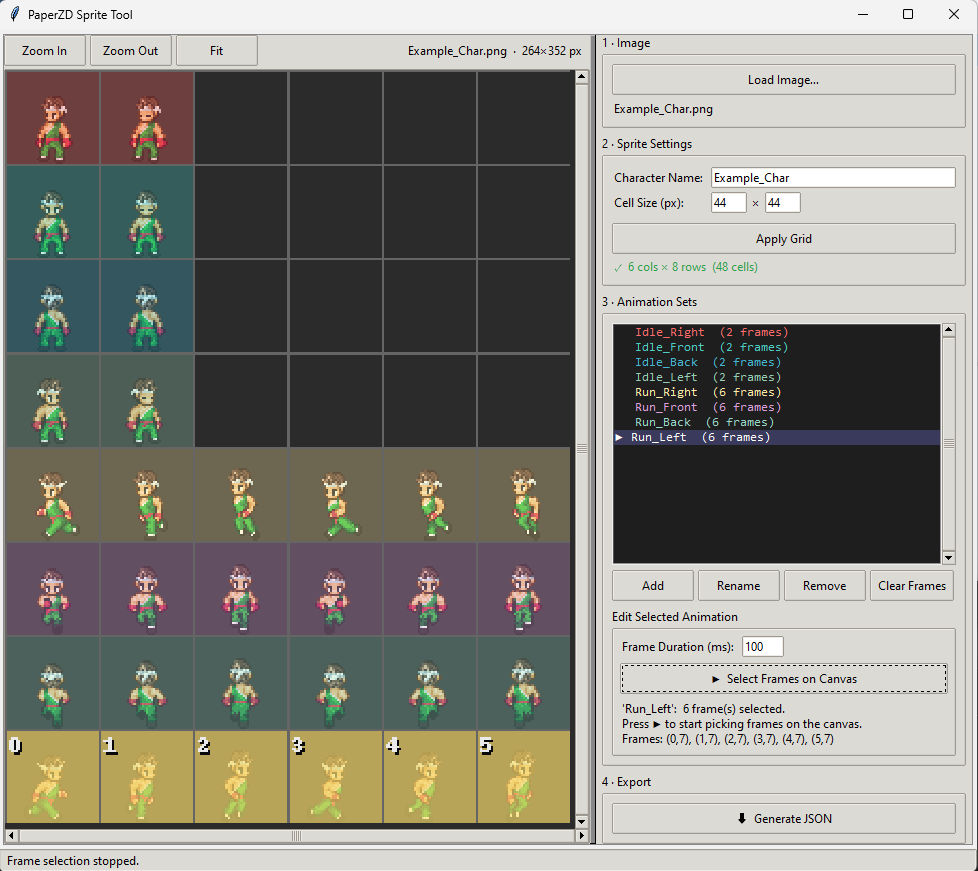

# PaperZD Sprite Tool

A free, no-code desktop tool for 2D artists to generate the JSON files required by the **[PaperZD](https://www.fab.com/listings/f4d2c7d9-6e93-4cd1-a0b5-f1dc69d99c17)** Unreal Engine plugin.

---

## ⬇️ Download

Grab the latest **`PaperZD Sprite Tool.exe`** from the [**Releases**](https://github.com/brunogbrito/PaperZD-Sprite-Tool/releases) page.  
No installation required, just run it.

---

## What does it do?

Working with PaperZD requires a `.json` file that maps every animation frame in your sprite sheet to its pixel position in the texture. This tool lets you build it visually instead.

Load your sprite sheet, set the cell size, create your animation sets, click the frames in order, and hit **Generate JSON**. That's it, no code, no spreadsheets, no guessing pixel coordinates.

---

## How to use

### 1 · Load your sprite sheet
Click **Load Image…** and pick your PNG (or JPG) sprite sheet.

### 2 · Set the cell size
Enter the pixel dimensions of a single sprite frame in the **Cell Size** fields (e.g. `44 × 44`).  
Click **Apply Grid** — a grid overlay will appear on your texture.

### 3 · Add animation sets
Click **Add** under *Animation Sets* and give it a name (e.g. `Idle_L`, `Run_D`).  
Set the **Frame Duration** in milliseconds (default: `100 ms`).

### 4 · Select frames
With an animation selected, click **▶ Select Frames on Canvas**.  
Then click the cells in your texture **in the order they should play**.  
Each animation gets a distinct color; frame indices are shown on the cells.  
Click a selected cell again to deselect it.

### 5 · Export
Once all animations are set up, click **⬇ Generate JSON**.  
Save the `.json` file next to your texture PNG.

### 6 · Import into Unreal
Drag the `.json` into your Unreal project — PaperZD will automatically detect the JSON and create the Sprites for you.
(the sprite image must be in the same folder as the .json)

---

## License

[MIT](LICENSE) — free to use, modify, and distribute.
